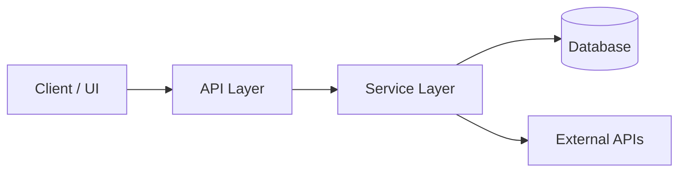

# Project: <name> — Claude-specific notes

> The project's facts (stack, commands, verify command, writing style,
> boundaries, conventions) live in `AGENTS.md` at the repo root — every agent
> tool reads that. This file is optional and holds ONLY things specific to
> Claude Code. If nothing here applies, don't create this file.

Read `AGENTS.md` first. It wins on any conflict.

## Claude-specific

- **Subagents this project uses:** `<e.g., codebase-explorer, code-reviewer — or "defaults">`
- **Model overrides:** `<e.g., use opus for /plan in this repo — or "defaults">`
- **MCP servers / tools needed:** `<list or "none">`
- **Permission notes:** `<e.g., allowed commands beyond defaults>`

## Smoke test (default recipe)

> Plans should override this with feature-specific smoke tests when needed.
> This is the baseline: "is the app running and not obviously broken?"

1. `<step to bring up the app locally — e.g., npm run dev>`
2. `<navigate to URL / hit endpoint>`
3. `<expected behavior — what "working" looks like>`

## Architecture notes

> Paste a brief overview or a Mermaid diagram of the major modules and how
> they relate. Anything non-obvious that the AI should respect goes here.

Key boundaries:

- `<module A>` does not import from `<module B>` (one-way dependency)
- All external API calls go through `<adapter location>`
- Errors are normalized via `<error utility location>`

## Notes for the workflow

- This project uses the five-phase delivery workflow (`/research` → `/plan` → `/implement` → `/review` → `/address-pr`). The user-level `~/.agents/AGENTS.md` defines the phase discipline.
- Per-feature working state lives in `.agents/work/<feature-slug>/` (gitignored). `.agents/templates/` and `.agents/README.md` are committed.
- If anything in this file or `AGENTS.md` becomes stale, update it as part of the PR that introduced the change.
